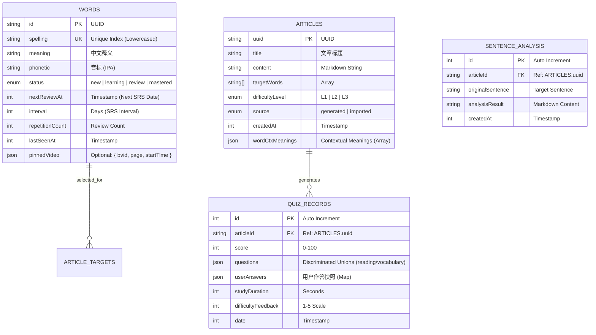

# 项目架构 (Project Architecture)

此文档为项目开发的**唯一真理来源 (SSOT)**。所有新增代码必须严格遵守以下规范。

## 1. 核心目录结构 (Core Directory Structure)

项目遵循 "Feature-First" 与 "Atomic" 相结合的组织方式：

```bash
src/
├── assets/                 # 静态资源 (Images, Global CSS)
├── components/             # UI 组件库
│   ├── common/             # 通用基础组件 (BaseListCard, PageLoading, PageError)
│   └── layout/             # 布局组件 (Sidebar, Header, MainLayout)
├── features/               # 业务功能模块 (推荐)
│   ├── reading/            # 阅读相关 (ReaderView, ArticleGenerator)
│   ├── words/              # 单词本相关 (WordList, WordCard)
│   ├── quiz/               # 测试相关 (QuizForm, ResultChart)
│    ├── history/            # 学习记录 (QuizHistory, HistoryListCard, QuizResult)
│   ├── onboarding/         # [NEW] 首次引导 (OnboardingDialog)
│   ├── drill/              # [NEW] 每日特训 (Selection, Process, Exam)
├── hooks/                  # 全局自定义 Hooks (useAsyncData, useStudyTimer)
├── pages/                  # 路由页面 (Home, Library, Settings, NotFoundPage)
├── theme/                  # [NEW] 主题配置 (constants.ts)
├── services/               # 数据服务层 (API & DB)
│   ├── db.ts               # Dexie 数据库实例配置
│   ├── llmService.ts       # AI 接口服务 (Deepseek)
│   ├── studyService.ts     # [NEW] 学习流程核心逻辑 (Decoupled from UI)
│   ├── prompts.ts          # [NEW] 静态 AI Prompts 库
│   ├── questionInfo.ts     # [NEW] 问题类型守卫 (Type Guards)
│   ├── dictionary.ts       # 外部词典 API
│   └── statsService.ts     # 统计数据聚合服务
├── types/                  # 全局 TypeScript 类型定义
├── utils/                  # 纯函数工具库 (formatting, date, math)
├── App.tsx                 # 根组件 (Providers, Router Outlet)
└── main.tsx                # 入口文件
```

## 2. 数据库 ER 图 (Database Implementation)

基于 **Dexie.js (IndexedDB)** 的本地存储模型。
*注意: 由于是 NoSQL 文档型存储，部分关联仅为逻辑概念。*



## 3. API 响应标准 (Standard API Response)

所有后端接口 (包括 AI 生成的伪造响应) 均需返回以下标准 JSON 结构：

```typescript
interface ApiResponse<T> {
  /** 
   * 业务状态码
   * 200: 成功
   * 400: 客户端参数错误
   * 500: 服务端/AI生成错误 
   */
  code: number;
  
  /** 提示消息 (可以直接展示给用户) */
  message: string;
  
  /** 数据载荷 */
  data: T;
  
  /** 响应时间戳 */
  timestamp: number;
}
```

### JSON 示例
**成功 (Success):**
```json
{
  "code": 200,
  "message": "文章生成完毕",
  "data": {
    "articleId": "550e8400-e29b-41d4-a716-446655440000",
    "content": "Once upon a time..."
  },
  "timestamp": 1709880000123
}
```

**失败 (Error):**
```json
{
  "code": 500,
  "message": "API Key 配额已耗尽，请检查设置",
  "data": null,
  "timestamp": 1709880000123
}
```
## 4. Internationalization (I18n)
- **Library**: react-i18next
- **Locale Files**:
  - `src/locales/zh-CN.json` (或对应文件)
  - `src/locales/en-US.json` (或对应文件)
- **Usage**:
  - Hooks: `const { t } = useTranslation();`
  - Keys: Nested JSON structure preferred.

## 5. 技术栈约定 (Tech Stack)

| 领域 | 选型 | 规范说明 |
| :--- | :--- | :--- |
| **UI 框架** | **Material-UI (MUI V5)** | 优先使用 `<Box>`, `<Stack>`, `<Typography>` 等组件，减少手写 CSS。 |
| **样式系统** | **Emotion (sx props)** | 禁止使用 `.css` 文件 (全局 reset 除外)，所有样式通过 `sx={{...}}` 或 `styled()` 编写。 |
| **路由** | **React Router V6** | 使用 `useNavigate` 跳转，不使用 `<a>` 标签。 |
| **状态管理** | **Context + Hooks** | 避免引入 Redux。简单状态用 `useState`，全局配置用 `Context`。 |
| **持久化** | **Dexie.js** | 所有的用户数据必须存入 IndexedDB，不使用 LocalStorage 存大量数据。 |
| **测试** | **Vitest + RTL** | 使用 `vitest` 做单元测试，`happy-dom` 模拟环境。 |
| **图标** | **MUI Icons** | 统一使用 `@mui/icons-material`。 |

| **NLP** | **compromise** | 轻量级客户端自然语言处理 (Lemmatization) |

## 7. Video Indexing Pipeline (视频索引工具链)

位于 `scripts/video_indexer/` 下的 Python 工具链，用于生成单词与视频的时间戳映射。

*   **indexer_shared.py**: 核心逻辑库（停用词、词形还原、打分过滤、缓存管理）。
*   **bilibili_indexer.py**: B站视频索引器 (使用 `you-get`)，输出 `video_map_bilibili.json`。
*   **youtube_indexer.py**: YouTube 视频索引器 (使用 `yt-dlp`)，输出 `video_map_youtube.json`。支持 Playlist 批量下载与 `--min-score` 过滤参数。
*   **Data Flow**: `Download (Audio) -> Whisper (ASR) -> Lemmatization -> Indexing -> Sharding (index_{char}.json)`

## 6. 响应式适配策略 (Responsive Design Strategy)

为了确保在 iPad 及平板设备上的最佳体验，必须遵循以下适配规则：

### 6.1 导航栏响应逻辑
由于侧边栏宽度 (240px) 较大，在平板设备上必须折叠以释放内容空间。
*   **Desktop (`lg` / ≥1200px)**: `Permanent Drawer` (固定侧边栏)。
*   **Tablet/Mobile (`md`, `sm`, `xs` / <1200px)**: `Temporary Drawer` (汉堡菜单呼出)。
    *   *Rationale*: iPad Landscape (1024px) 扣除侧边栏后仅剩 784px，会导致各类卡片严重挤压。

### 6.2 布局断点 (Grid Breakpoints)
*   **Card Grid**:
    *   `xs`: 1列 (Stack)
    *   `md`: 1列 (Stack) - *iPad Portrait 强制堆叠*
    *   `lg`: 2列 (Split) - *仅在大屏/横屏 Desktop 下分栏*

